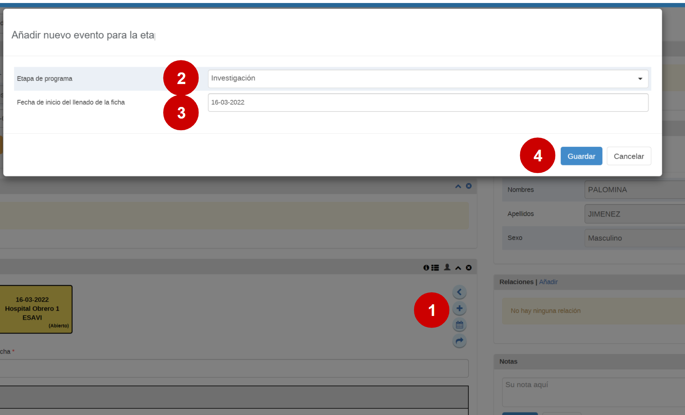

# Guía rápida de entrada de datos para el PROGRAMA CENTINELA

Esta guía es una ayuda para la entrada de datos, no contiene todos los pasos sinó los pasos mas básicos para ingresar un caso en el programa centinela 

## Tabla de contenidos

- [Guía rápida de entrada de datos para el PROGRAMA CENTINELA](#gu-a-r-pida-de-entrada-de-datos-para-el-programa-centinela)
  * [Flujo de trabajo](#flujo-de-trabajo)
  * [Entrada de Datos - Como registrar una persona](#entrada-de-datos---como-registrar-una-persona)
    + [1) Abrir la aplicación "registro de datos de seguimiento"](#1--abrir-la-aplicaci-n--registro-de-datos-de-seguimiento-)
    + [2) Registrar una nueva persona](#2--registrar-una-nueva-persona)
    + [3) Completar los datos de perfil de la persona](#3--completar-los-datos-de-perfil-de-la-persona)
    + [4) Click en "guardar y continuar"](#4--click-en--guardar-y-continuar-)
  * [Entrada de Datos – Etapa de clasificación inicial](#entrada-de-datos---etapa-de-clasificaci-n-inicial)
    + [1) Seleccionar la etapa de clasificación y seleccionar la fecha de inicio](#1--seleccionar-la-etapa-de-clasificaci-n-y-seleccionar-la-fecha-de-inicio)
    + [2) Completar los datos de la persona notificadora](#2--completar-los-datos-de-la-persona-notificadora)
    + [3)  MODIFICAR EL RESTO DE LAS INSTRUCCIONES PARA LA ETAPA DE CLASIFICACIón CUANDO ESTÈ LISTA](#3---modificar-el-resto-de-las-instrucciones-para-la-etapa-de-clasificaci-n-cuando-est--lista)
    + [4) Seleccione el botón "completar"](#4--seleccione-el-bot-n--completar-)
  * [Entrada de Datos – Notificación ESAVI](#entrada-de-datos---notificaci-n-esavi)
    + [1) Con la etapa de Notificación ESAVI seleccionada, elegir la fecha de notificación ESAVI](#1--con-la-etapa-de-notificaci-n-esavi-seleccionada--elegir-la-fecha-de-notificaci-n-esavi)
    + [2) Rellenar la información del paciente](#2--rellenar-la-informaci-n-del-paciente)
    + [3) Complete los datos acerca de la vacuna que pudo estar relacionada con el ESAVI](#3--complete-los-datos-acerca-de-la-vacuna-que-pudo-estar-relacionada-con-el-esavi)
    + [4) Complete los datos acerca del ESAVI](#4--complete-los-datos-acerca-del-esavi)
    + [5) Completar el evento dandole click al botón "Completar"](#5--completar-el-evento-dandole-click-al-bot-n--completar-)
  * [Entrada de datos - Investigación](#entrada-de-datos---investigaci-n)
    + [1) Teniendo la etapa de Investigación seleccionada, hacer click en el ‘+’ para crear un evento](#1--teniendo-la-etapa-de-investigaci-n-seleccionada--hacer-click-en-el-----para-crear-un-evento)
    + [2) Seleccionar la fecha del reporte y hacer click en “Guardar”](#2--seleccionar-la-fecha-del-reporte-y-hacer-click-en--guardar-)
    + [3) Rellenar el formulario de investigación con sus datos correspondientes](#3--rellenar-el-formulario-de-investigaci-n-con-sus-datos-correspondientes)
    + [4) Completar la investigación dándole click al botón "Completar"](#4--completar-la-investigaci-n-d-ndole-click-al-bot-n--completar-)
  * [Entrada de datos - Nivel Nacional](#entrada-de-datos---nivel-nacional)
    + [1) Teniendo la Etapa “Nivel Nacional” seleccionada, hacer click en el ‘+’](#1--teniendo-la-etapa--nivel-nacional--seleccionada--hacer-click-en-el----)
    + [2) Seleccionar la fecha del reporte](#2--seleccionar-la-fecha-del-reporte)
    + [3) Completar la ficha con los datos correspondientes](#3--completar-la-ficha-con-los-datos-correspondientes)
    + [4) Completar la clasificación a nivel nacional dandole click al botón completar](#4--completar-la-clasificaci-n-a-nivel-nacional-dandole-click-al-bot-n-completar)

<small><i><a href='http://ecotrust-canada.github.io/markdown-toc/'>Table of contents generated with markdown-toc</a></i></small>

## Flujo de trabajo

Tanto ESAVIs como EVADIEs se registran en el mismo programa

---------------

## Entrada de Datos - Como registrar una persona

### 1) Abrir la aplicación "registro de datos de seguimiento"

### 2) Registrar una nueva persona

1. Seleccionar la instalación correspondiente
2. Seleccionar el Programa Centinela
3. Click en "registrar"

### 3) Completar los datos de perfil de la persona

### 4) Click en "guardar y continuar"

-----------------------

## Entrada de Datos – Etapa de clasificación inicial

En esta etapa se clasifican los casos y se decide si es un ESAVI o un EVADIE

### 1) Seleccionar la etapa de clasificación y seleccionar la fecha de inicio

### 2) Completar los datos de la persona notificadora

### 3)  MODIFICAR EL RESTO DE LAS INSTRUCCIONES PARA LA ETAPA DE CLASIFICACIón CUANDO ESTÈ LISTA

### 4) Seleccione el botón "completar"

------------------------

## Entrada de Datos – Notificación ESAVI

### 1) Con la etapa de Notificación ESAVI seleccionada, elegir la fecha de notificación ESAVI

### 2) Rellenar la información del paciente

>Seleccione o ingrese todos los campos necesarios. Algunos permanecerán ocultos cuando no sean relevantes (Por ejemplo, los campos relacionados al embarazo solo aparecerán cuando se trate de pacientes de sexo femenino.

### 3) Complete los datos acerca de la vacuna que pudo estar relacionada con el ESAVI

> En el caso de una vacuna contra COVID-19, complete todas las dosis administradas.

El nombre de la vacuna, fecha y hora de vacunación y número de lote son campos obligatorios

### 4) Complete los datos acerca del ESAVI

Seleccione el ESAVI y la fecha de inicio

> Describa el ESAVI en detalle. Si es un evento grave se habilitan las opciones para reportarlo

### 5) Completar el evento dandole click al botón "Completar"

------------

## Entrada de datos - Investigación

> IMPORTANTE: Para que la etapa de Investigación esté habilitada, deberá primero seleccionarse el elemento de datos “¿Se requiere investigación?” en la etapa de notificación ESAVI.

### 1) Teniendo la etapa de Investigación seleccionada, hacer click en el ‘+’ para crear un evento

### 2) Seleccionar la fecha del reporte y hacer click en “Guardar”

### 3) Rellenar el formulario de investigación con sus datos correspondientes

> Importante: no es necesario completar la investigación si todavía faltan datos. Los datos ingresados serán guardados aún cuando el evento no esté completado.

ES NECESARIO AGREGAR MAS INFORMACIÒN EN ESTA GUÌA CUANDO ESTE CONFIGURADA LA ETAPA

### 4) Completar la investigación dándole click al botón "Completar"

---------

## Entrada de datos - Nivel Nacional

Esta etapa está disponible solo para usuarios con un rol a nivel nacional.

### 1) Teniendo la Etapa “Nivel Nacional” seleccionada, hacer click en el ‘+’ 

### 2) Seleccionar la fecha del reporte 

### 3) Completar la ficha con los datos correspondientes 

1. Seleccione las fechas orrespondientes
2. Describa el diagnóstico final con texto libre
3. Seleccione la clasificación y subclasificación correspondiente

### 4) Completar la clasificación a nivel nacional dandole click al botón completar

---------------------------

