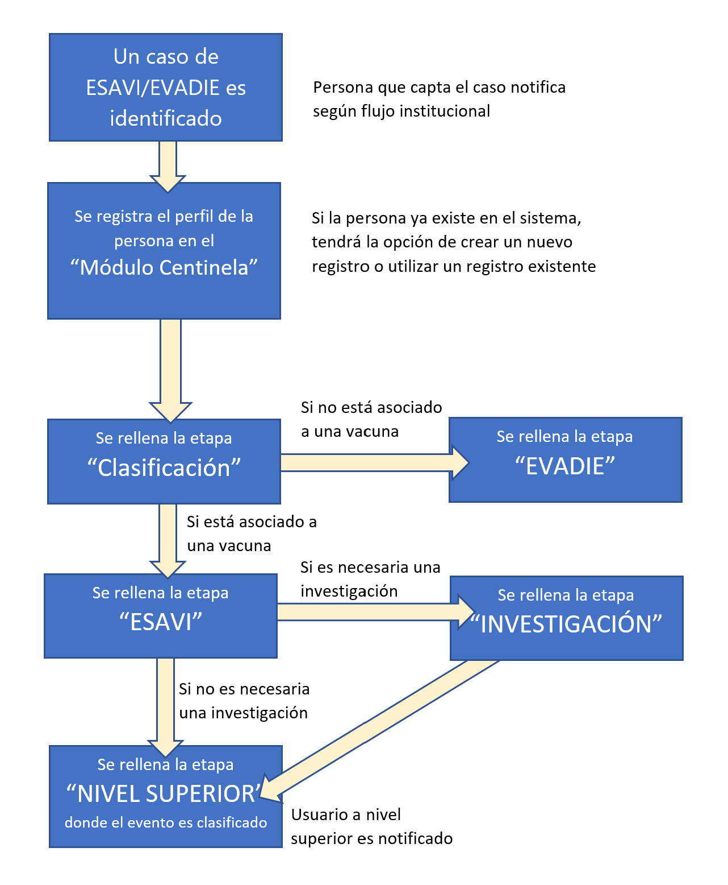
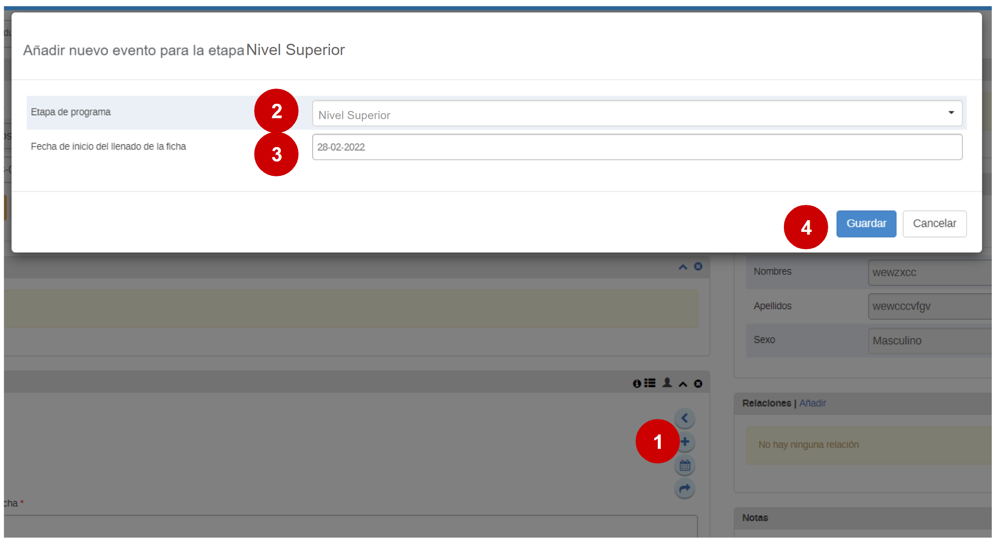
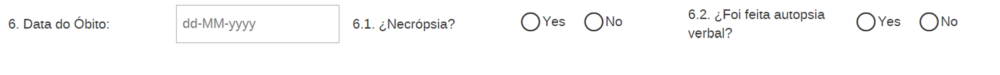

# Guía rápida de entrada de datos para el PROGRAMA CENTINELA

Esta guía es una ayuda para la entrada de datos, no contiene todos los pasos sinó los pasos mas básicos para ingresar un caso en el programa centinela 

## Tabla de contenidos

  - [Flujo de trabajo](#flujo-de-trabajo)
  - [Entrada de Datos - Como registrar una persona](#entrada-de-datos---como-registrar-una-persona)
  - [Entrada de Datos – Etapa de clasificación inicial](#entrada-de-datos--etapa-de-clasificacion-inicial)
  - [Entrada de Datos ESAVI – Notificación ESAVI](#entrada-de-datos--notificacion-esavi)
  - [Entrada de datos ESAVI - Investigación](#entrada-de-datos---investigacion)
  - [Entrada de datos ESAVI - Nivel Nacional](#entrada-de-datos---nivel-nacional)
  - [Entrada de datos EVADIE](#entrada-de-datos-evadie)
  - [Buscar un caso](#buscar-un-caso)
  - [Como usar filtros](#como-usar-filtros)
  - [Utilizando la lista de trabajo personalizada](#utilizando-la-lista-de-trabajo-personalizada)

## Flujo de trabajo

Tanto ESAVIs como EVADIEs se registran en el mismo programa

---------------

## Entrada de Datos - Como registrar una persona

### 1) Abrir la aplicación "registro de datos de seguimiento"

### 2) Registrar una nueva persona

1. Seleccionar el Hospital correspondiente
2. Seleccionar el Programa "Módulo Centinela"
3. Click en "registrar"

### 3) Completar los datos de perfil de la persona

### 4) Click en "guardar y continuar"

-----------------------

## Entrada de Datos – Etapa de clasificacion inicial

En esta etapa se clasifican los casos y se decide si es un ESAVI o un EVADIE

### 1) Seleccionar la etapa de clasificación y seleccionar la fecha de inicio

### 2) Completar los datos de la persona notificadora

### 3)  MODIFICAR EL RESTO DE LAS INSTRUCCIONES PARA LA ETAPA DE CLASIFICACIón CUANDO ESTÈ LISTA

### 4) Seleccione el botón "completar"

------------------------

## Entrada de Datos – Notificacion ESAVI

### 1) Con la etapa de Notificación ESAVI seleccionada, elegir la fecha de notificación ESAVI

### 2) Rellenar la información del paciente

>Seleccione o ingrese todos los campos necesarios. Algunos permanecerán ocultos cuando no sean relevantes (Por ejemplo, los campos relacionados al embarazo solo aparecerán cuando se trate de pacientes de sexo femenino.

### 3) Complete los datos acerca de la vacuna que pudo estar relacionada con el ESAVI

> En el caso de una vacuna contra COVID-19, complete todas las dosis administradas.

El nombre de la vacuna, fecha y hora de vacunación y número de lote son campos obligatorios

### 4) Complete los datos acerca del ESAVI

Seleccione el ESAVI y la fecha de inicio

> Describa el ESAVI en detalle. Si es un evento grave se habilitan las opciones para reportarlo

### 5) Completar el formulario dandole click al botón "Completar"

Los datos son guardados automáticamente cuando se ingresan, el botón de completar se utiliza para indicar que el formualrio ya está completo. 

------------

## Entrada de datos - Investigacion

> IMPORTANTE: Para que la etapa de Investigación esté habilitada, deberá primero seleccionarse la opción “¿Se requiere investigación?” en la etapa de notificación ESAVI.

### 1) Teniendo la etapa de Investigación seleccionada, hacer click en el ‘+’ para crear un evento

### 2) Seleccionar la fecha del reporte y hacer click en “Guardar”

### 3) Rellenar el formulario de investigación con sus datos correspondientes

> Importante: no es necesario completar la investigación si todavía faltan datos. Los datos ingresados serán guardados aún cuando el evento no esté completado.

ES NECESARIO AGREGAR MAS INFORMACIÒN EN ESTA GUÌA CUANDO ESTE CONFIGURADA LA ETAPA

### 4) Completar la investigación dándole click al botón "Completar"

---------

## Entrada de datos - Nivel Nacional

Esta etapa está disponible solo para usuarios con un rol a nivel nacional.

### 1) Teniendo la Etapa “Nivel Nacional” seleccionada, hacer click en el ‘+’ 

### 2) Seleccionar la fecha del reporte 

### 3) Completar la ficha con los datos correspondientes 

1. Seleccione las fechas orrespondientes
2. Describa el diagnóstico final con texto libre
3. Seleccione la clasificación y subclasificación correspondiente

### 4) Completar la clasificación a nivel nacional dandole click al botón completar

---------------------------

## Entrada de datos EVADIE

### 1) Seleccionar la etapa de EVADIE y seleccionar la fecha de inicio

### 2) Rellenar los datos del efecto adverson siguiendo el orden del formulario

1.Marque la(s) opción(es) correspondientes.
> Cada opción seleccionada desplegará una nueva sección con mas detalles.
2. Selecciona la fecha y hora del inicio de los síntomas
3. Describa los síntomas utilizando texto libre

### 3)  Rellenar los datos referentes al resultado del EVADIE

1. Seleccionar los resultados del EVADIE

2. Seleccione utilizando la lista desplegable,  el estado del paciente al momento de la identificación del EVADIE

Seleccione utilizando la lista desplegable,  el estado del paciente al momento de la identificación del EVADIE

3. En caso de fallecimiento, se habilita la entrada de datos en los elementos correspondientes 

### 4) Rellenar los datos relacionados a la salud general del paciente

1. Seleccionar hasta seis distintas enfermedades previas utilizando las listas.

Rellenar datos de embarazo, si corresponde

2. Seleccionar los medicamentos que esté tomando el caso utilizando el buscador, y rellenar los datos correspondientes.

3. Seleccionar los hábitos de consumo 

### 5) Rellenar los datos acerca de las vacunas contra el Covid-19

Los nombres de las vacunas están basados en listas predeterminadas, otros datos son rellenados de manera manual.

### 6) Rellenar los datos acerca de otras vacunas recibidas 30 días antes del EVADIE

Los nombres de las vacunas están basados en listas predeterminadas, otros datos son rellenados de manera manual.

### 7) Completar el evento

--------------------------------------

## Buscar un caso

### 1) Estando en la lista de casos, click en el botón "buscar

1. Seleccionar la unidad organizativa
2. Seleccionar el programa Centinela
3. Click en BUSCAR

### 2) Ejecutar la busqueda

Ingresar los parámetros deseados y hacer click en la lupa

### 3) Seleccionar el caso de entre los que aparezcan en la ventana de resultados

-----------------------

## Como usar filtros

### 1) Estando en la lista de casos, seleccionar uno de los filtros preconfigurados

### 2) Que significan los símbolos?

1. O = Activos 
2. V = Completos
3. X = Inscripción cancelada

### 3) Seleccionar la persona de la lista para ir a su perfil

-------------

## Utilizando la lista de trabajo personalizada 

### 1) Seleccionar "lista de trabajo personalizada"

### 2) Seleccionar las opciones para tu lista personalizada y click en "Buscar"

 

### 3) Seleccionar la persona de la lista para ir a su perfil

