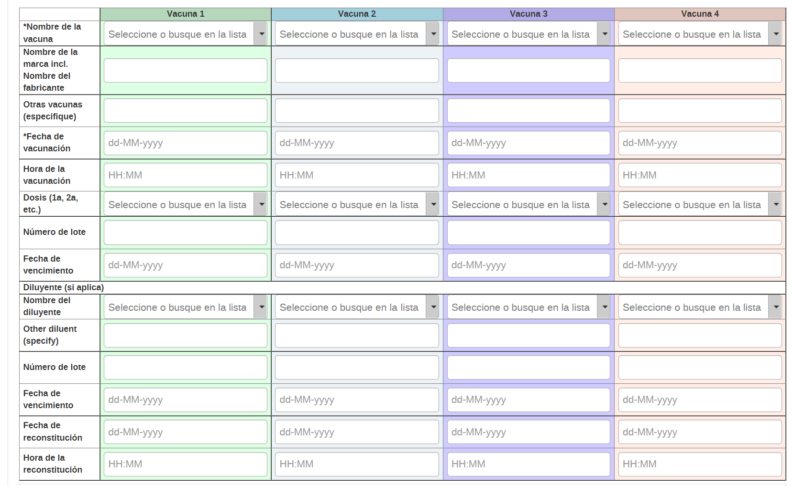

# Guía rápida de entrada de datos para el PROGRAMA CENTINELA

> Esta guía es una ayuda para la entrada de datos, no contiene todos los pasos sinó los pasos mas b´sicos para ingresar un caso en el programa centinela 

## FLujo de trabajo

>Tanto ESAVIs como EVADIEs se registran en el mismo programa

---------------

## Entrada de Datos - Como registrar una persona

### 1) Abrir la aplicación "registro de datos de seguimiento"

### 2) Registrar una nueva persona

> 1. Seleccionar la instalación correspondiente
> 2. Seleccionar el Programa Centinela
> 3. Click en "registrar"

### 3) Completar los datos de perfil de la persona

### 4) Click en "guardar y continuar"

-----------------------

## Entrada de Datos – Etapa de clasificación inicial

> En esta etapa se clasifican los casos y se decide si es un ESAVI o un EVADIE

### 1) Seleccionar la etapa de clasificación y seleccionar la fecha de inicio

### 2) Completar los datos de la persona notificadora

### 3)  MODIFICAR EL RESTO DE LAS INSTRUCCIONES PARA LA ETAPA DE CLASIFICACIón CUANDO ESTÈ LISTA

### 4) Seleccione el botón "completar"

------------------------

## Entrada de Datos – Notificación ESAVI

### 1) Con la etapa de Notificación ESAVI seleccionada, elegir la fecha de notificación ESAVI

### 2) Rellenar la información del paciente

>Seleccione o ingrese todos los campos necesarios. Algunos permanecerán ocultos cuando no sean relevantes (Por ejemplo, los campos relacionados al embarazo solo aparecerán cuando se trate de pacientes de sexo femenino.

### 3) Complete los datos acerca de la vacuna que pudo estar relacionada con el ESAVI

> En el caso de una vacuna contra COVID-19, complete todas las dosis administradas.

> El nombre de la vacuna, fecha y hora de vacunación y número de lote son campos obligatorios

### 4) Complete los datos acerca del ESAVI

> Seleccione el ESAVI y la fecha de inicio

> Describa el ESAVI en detalle. Si es un evento grave se habilitan las opciones para reportarlo

### 5) Completar el evento dandole click al botón "Completar"

